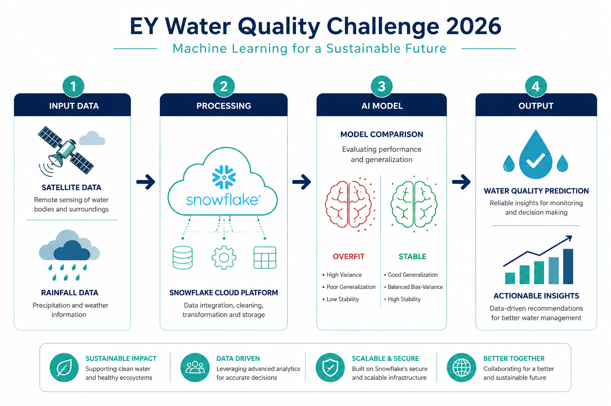
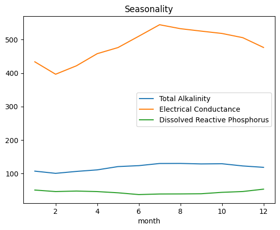

# Satellite climate water ML

## Overview
This repository is a fork of the official EY AI & Data Challenge and contains my work for the 2026 EY AI & Data Challenge: Optimizing Clean Water Supply.

The challenge focuses on leveraging data and AI to improve the efficiency, sustainability, and equity of clean water supply systems.
This fork is maintained by Barbara Ángeles Ortiz and is used as a hands-on environment to explore:

* Data preparation and analysis workflows
* Machine Learning experimentation
* Optimization strategies for real-world resource allocation problems
* Snowflake ML and Snowpark-based development

🔗 Official Challenge: [EY AI & Data Challenge 2026](https://challenge.ey.com/challenges/2026-optimizing-clean-water-supply)

---
## 🌍 Why This Matters

By accurately predicting water quality parameters through remote sensing and machine learning, we can significantly reduce the reliance on costly and labor-intensive physical sampling. This data-driven approach provides **scalable, real-time insights** to ensure safer water distribution and improved resource management, particularly in **underserved regions** where traditional monitoring infrastructure is often limited.

---
## Project Description

This project explores how data-driven and AI-based approaches can be applied to optimize clean water supply systems. Specifically, this repository has been updated for **Phase 2** of the challenge, focusing on:

* **Advanced Feature Engineering:** Integration of high-resolution climate data, including **Potential Evapotranspiration (PET)**, **Precipitation (PR)**, and **Maximum Temperature (TMAX)**.
* **Model Robustness & Generalization:** Moving beyond baseline models to address overfitting by comparing **RandomForest** (high-variance) against **HistGradientBoosting** (robust-regularized) architectures.
* **Spatial Join Optimization:** Implementation of KDTree-based spatial joins to efficiently map climate data to water sampling coordinates.
* **Iterative ML Workflow:** Evaluation of models based on their ability to generalize to unseen data, prioritizing stable $R^2$ metrics over training-only performance.



!(images/schema.png)

---
## 🧪 Methodology & Feature Engineering

The model's predictive power stems from the synergy between spectral satellite data and localized climatic variables:

* **Spectral Indices (Landsat):**
    * **NDMI & MNDWI:** Used as proxies for water surface moisture and open water detection.
    * **SWIR Bands:** Critical for distinguishing between suspended sediments and organic matter.
* **Climatic Drivers (TerraClimate):**
    * **Precipitation (PR):** Captures runoff events that introduce pollutants and minerals into water bodies.
    * **Max Temperature (TMAX):** Accounts for thermal effects on chemical solubility and biological activity.
    * **PET:** Provides context on evaporation rates affecting mineral concentrations.

Our feature engineering strategy was driven by two key insights:
1. **Target Independence:** The correlation analysis showed distinct behaviors for each parameter, justifying the use of individual models.
2. **Temporal Dynamics:** Seasonal trends highlighted the necessity of including Precipitation (PR) and Maximum Temperature (TMAX) to capture water quality fluctuations over time.




---

## Project Objectives

💧 Improve efficiency in clean water distribution using historical and contextual data

📈 Predict future water demand using Machine Learning models

⚙️ Explore optimization techniques under infrastructure and resource constraints

📊 Deliver insights that support data-driven decision-making in water management

---
## 🔍 Exploratory Data Analysis
To understand the spatial distribution of the water quality data, we mapped the sampling stations used in this challenge.


---
## 📊 Model Performance Summary (Phase 2)

We prioritized **model stability** over raw training accuracy. Below are the metrics for our production-ready **HistGradientBoosting** models:

| Parameter | $R^2$ (Train) | $R^2$ (Test) | Generalization Gap | Status |
| :--- | :---: | :---: | :---: | :---: |
| **Total Alkalinity** | 0.405 | 0.241 | 0.164 | ✅ Stable |
| **Electrical Conductance** | 0.412 | 0.209 | 0.203 | ✅ Stable |
| **Dissolved Reactive Phosphorus** | 0.378 | 0.209 | 0.169 | ✅ Stable |

*Note: While RandomForest achieved $R^2 > 0.85$ in training, it suffered from extreme overfitting ($R^2 < 0.10$ in test). The HistGradientBoosting approach was chosen for its reliable performance on unseen data.*

---

## Technologies & Tools

* **Python:** pandas, NumPy, scikit-learn
* **Machine Learning:** RandomForestRegressor, HistGradientBoostingRegressor
* **Spatial Analysis:** Scipy (cKDTree for efficient coordinate mapping)
* **Cloud Infrastructure:** Snowflake ML & Snowpark for Python
* **Data Sources:** Microsoft Planetary Computer (TerraClimate, Landsat)
* **Visualization:** Matplotlib, Seaborn

---
## Repository Structure

````
satellite-climate-water-ml
├── .github/
│   └── ISSUE_TEMPLATE/                 # Issue templates for the repository
│
├── scripts/
│   └── snowflake_setup.sql              # Snowflake environment and setup scripts
│
├── .gitignore                           # Git ignore rules
├── BENCHMARK_MODEL_NOTEBOOK_SNOWFLAKE.ipynb
│                                       # Benchmark ML model notebook in Snowflake
├── LANDSAT_DATA_EXTRACTION_NOTEBOOK_SNOWFLAKE.ipynb
│                                       # Data extraction from Landsat satellite sources
├── TERRACLIMATE_DATA_EXTRACTION_NOTEBOOK_SNOWFLAKE.ipynb
│                                       # TerraClimate data extraction and preprocessing
├── TERRACLIMATE_DEMONSTRATION_NOTEBOOK.ipynb
│                                       # Demonstration and analysis using TerraClimate data
├── getting_started_notebook.ipynb
│                                       # Introductory notebook for the challenge workflow
├── landsat_demo_notebook_snowflake.ipynb
│                                       # Landsat data demo using Snowflake
│
├── landsat_features_training.csv        # Training features derived from Landsat data
├── landsat_features_validation.csv      # Validation features derived from Landsat data
│
├── landsat_features_training_fase2.csv   # Updated training features (Phase 2)
├── landsat_features_validation_fase2.csv # Updated validation features (Phase 2)
│
├── terraclimate_features_training.csv   # Training features from TerraClimate datasets
├── terraclimate_features_validation.csv # Validation features from TerraClimate datasets
├── terraclimate_parameters.png          # Visualization of TerraClimate parameters
│
├── terraclimate_features_training_fase2.csv   # Phase 2 Climate features (pet, pr, tmax)
├── terraclimate_features_validation_fase2.csv # Phase 2 Climate features (pet, pr, tmax)
├── water_quality_training_dataset.csv   # Water quality training dataset
│
├── submission.csv                       # Final predictions using robust models
├── submission_template.csv              # Official submission template
│
├── requirements.txt                     # Dependencies
├── images                               # Figures
├── README.md                            # Project documentation
├── LICENSE                              # License information
└── LEGAL.md                             # Legal notices and attributions
````
---

## Key Outcomes

* **Reduced Model Overfitting:** Successfully narrowed the gap between Training and Testing $R^2$ by implementing regularized Gradient Boosting techniques.
* **Climate Feature Impact:** Identified **Precipitation (PR)** and **Temperature (TMAX)** as key drivers for improving water quality prediction stability.
* **Scalable Pipeline:** Created a robust, modular pipeline that handles spatial coordinate matching and multi-target prediction (Total Alkalinity, Conductance, and Phosphorus).
* **Automated Comparative Analysis:** Developed a comparison framework to evaluate model performance across different algorithms and versions.

---
## 📊 Model Performance Results

We achieved stable and reliable predictions across all three parameters using our regularized Gradient Boosting pipeline.

| Total Alkalinity | Electrical Conductance | Dissolved Reactive Phosphorus |
| :---: | :---: | :---: |
|  |  |  |
| *Stable Predictions* | *Conductivity Trends* | *Phosphorus Estimation* |
---
## Step-By-Step Guide
For prerequisites, setup, step-by-step guide and instructions, please refer to the [Developer Guide](https://www.snowflake.com/en/developers/guides/ey-ai-and-data-challenge/).

When you are ready to learn more about ML Development in Snowflake, you can follow this Developer Guide called ["Getting Started with Machine Learning Development in Snowflake"](https://www.snowflake.com/en/developers/guides/intro-to-machine-learning-with-snowpark-ml-for-python/#0).

In this guide, you will build a simple ML development workflow from feature engineering to model training and inference using Snowflake ML in Snowflake Notebooks on Container Runtime. 

---

## Author

**Bárbara Ángeles Ortiz**


[LinkedIn](https://www.linkedin.com/in/barbaraangelesortiz/) 

 📅 Abril 2026


---
## 🙏 Acknowledgments
* **Microsoft Planetary Computer:** For providing seamless access to Landsat and TerraClimate catalogs.
* **EY AI & Data Challenge:** For the opportunity to work on real-world sustainability problems.
* **Snowflake:** For the high-performance compute environment used for data extraction and ML training.

---
## Copyright
- Original contents © 2026 EY.  
- Contents in `/scripts/` © 2026 Snowflake Inc. under Apache 2 License.  
- Additions and modifications in this fork © 2026 Barbara Ángeles Ortiz.
